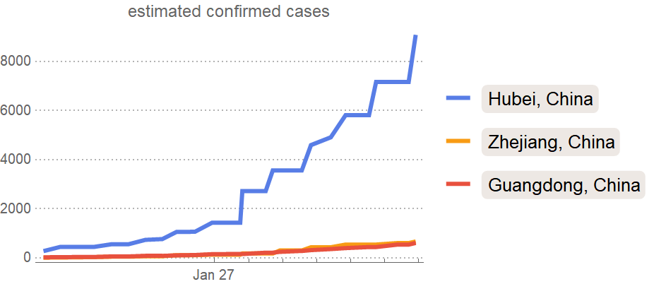
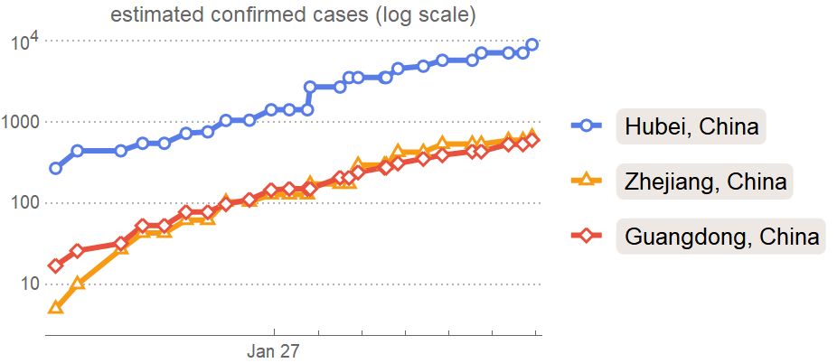
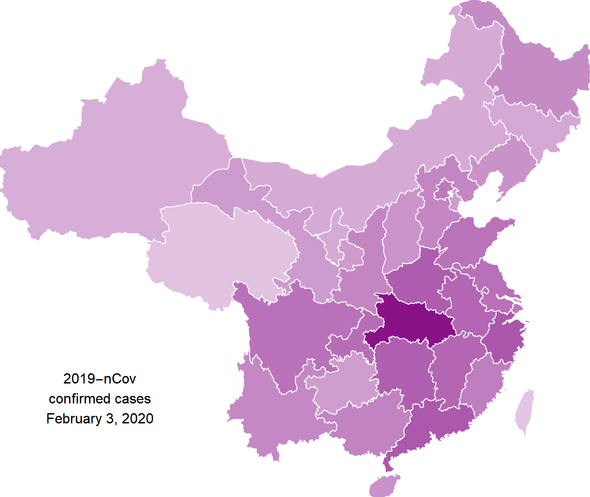
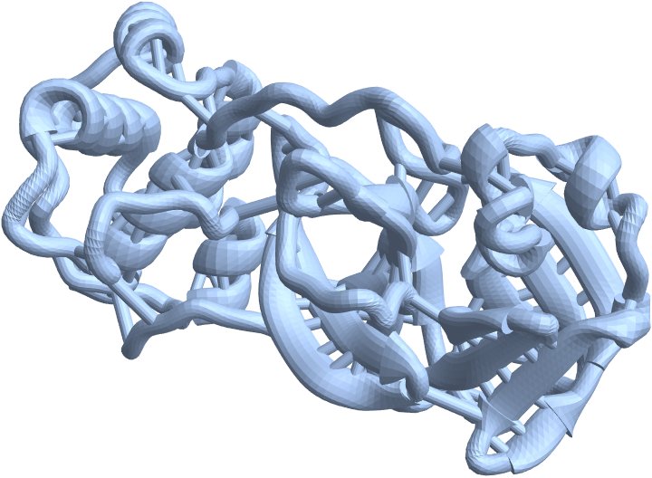
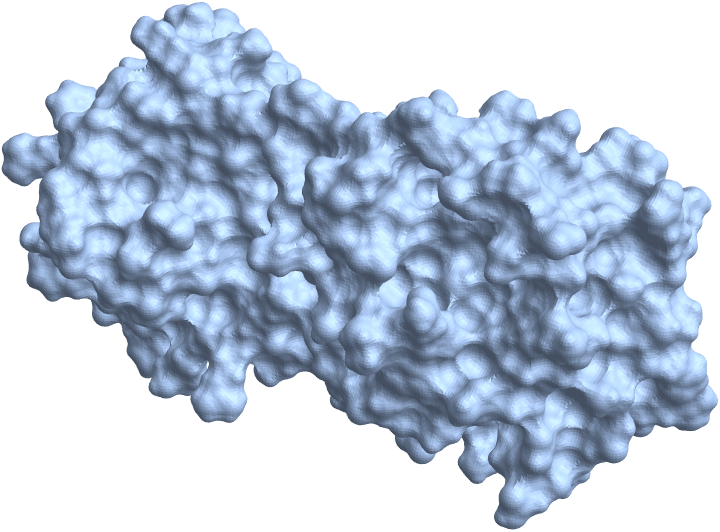

# Coronavirus

Wolfram Language code and notebooks related to the coronavirus outbreak

#### Sources

* [Epidemic data for novel coronavirus 2019-nCoV from Wuhan, China](https://datarepository.wolframcloud.com/resources/Epidemic-data-for-novel-coronavirus-2019-nCoV-from-Wuhan-China)
* [Mapping Wuhan coronavirus outbreak (2019-nCoV)](https://community.wolfram.com/groups/-/m/t/1868945)

## Results

### Animation of global spread of Coronavirus

### Confirmed cases

Plot of confirmed cases of the Coronavirus

Log plot of confirmed cases of the Coronavirus

Confirmed cases for 2/3/2020:

### Images

GitHub topic wordcloud for Coronavirus:

### 3D Models

Protease ribbon (source: https://3dprint.nih.gov/discover/3DPX-012893):

Protease surface (same source):

