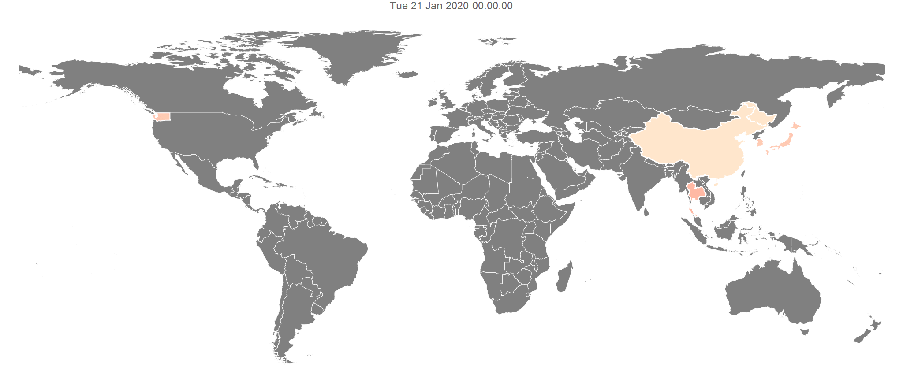
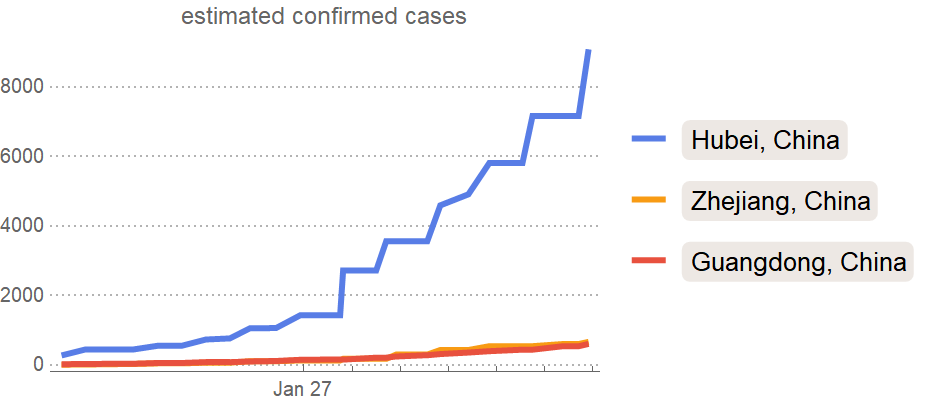
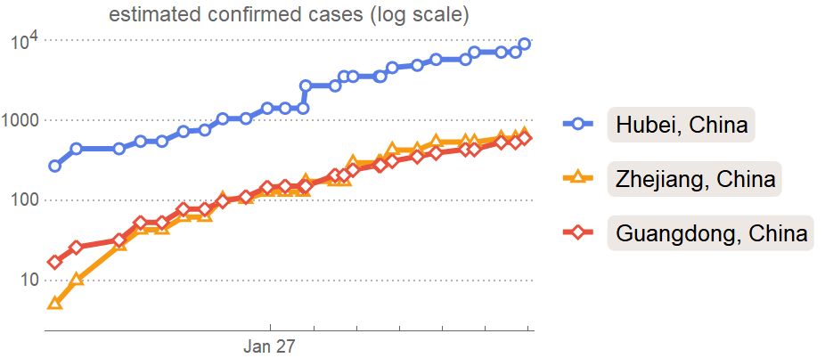
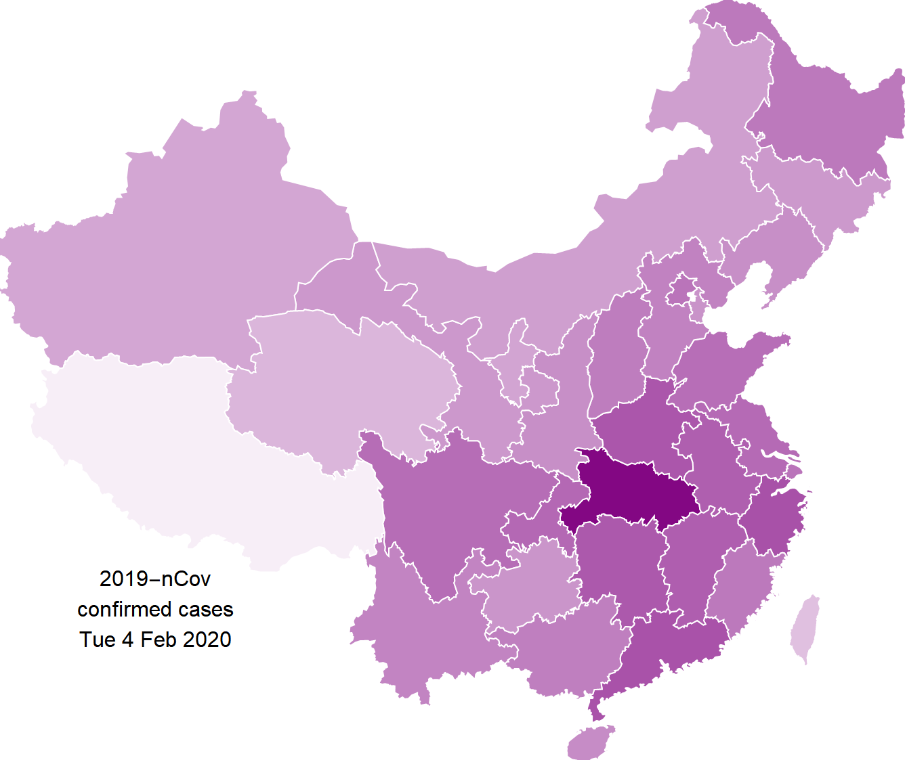
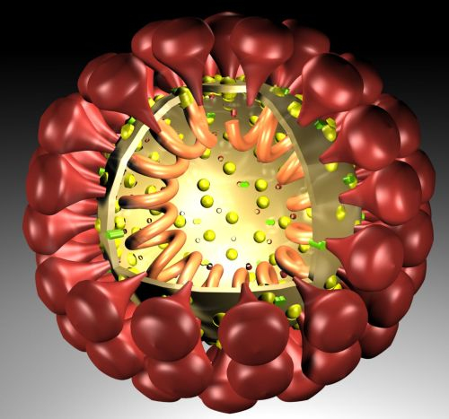
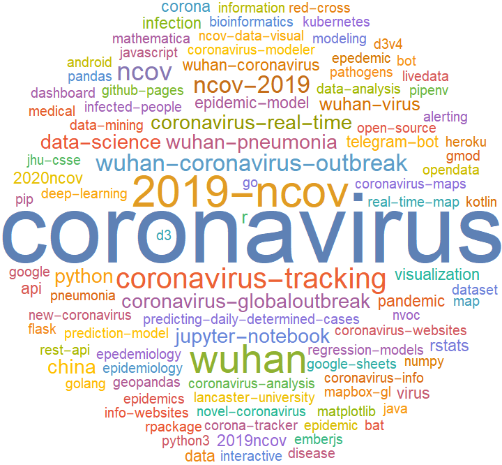
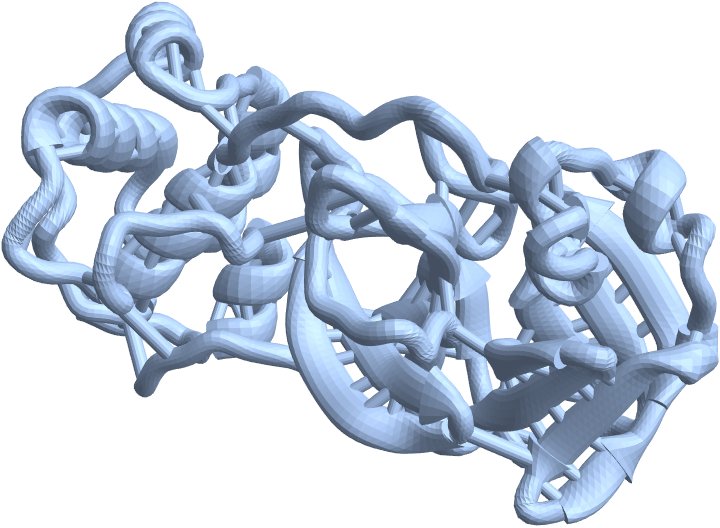
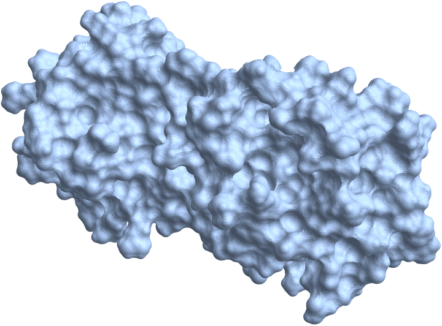

# Coronavirus

## Wolfram Language code and notebooks related to the coronavirus outbreak

#### Sources

Dashboard:

* [Dashboard with data](https://arnoudbuzing.github.io/wolfram-coronavirus/)

Twitch live streams:

* [Recording of my live Twitch session](https://www.twitch.tv/videos/547321229)
* [Coronavirus Data Exploration - Wolfram Livecoding with Students](https://www.twitch.tv/videos/548254391)

Wolfram Data Repository (datasets):

* [Top level search](https://datarepository.wolframcloud.com/search/?i=coronavirus)
* [Genetic Sequences for Novel Coronavirus 2019-nCoV from Wuhan, China](https://datarepository.wolframcloud.com/resources/Genetic-Sequences-for-Novel-Coronavirus-2019-nCoV-from-Wuhan-China)
* [Epidemic Data for Novel Coronavirus 2019-nCoV from Wuhan, China](https://datarepository.wolframcloud.com/resources/Epidemic-Data-for-Novel-Coronavirus-2019-nCoV-from-Wuhan-China)
* [Patient Medical Data for Novel Coronavirus 2019-nCoV from Wuhan, China](https://datarepository.wolframcloud.com/resources/Patient-Medical-Data-for-Novel-Coronavirus-2019-nCoV-from-Wuhan-China)

Posts on the Wolfram Community:

* [UPDATES -- Resources For Novel Coronavirus 2019-nCoV Wuhan China](https://community.wolfram.com/groups/-/m/t/1872608)
* [Genome analysis and the 2019-nCov](https://community.wolfram.com/groups/-/m/t/1874816)
* [Visualizing Sequence Alignments from the 2019-nCov](https://community.wolfram.com/groups/-/m/t/1875352)
* [Mapping Wuhan coronavirus outbreak (2019-nCoV)](https://community.wolfram.com/groups/-/m/t/1868945)

### Index to notebooks 

| file | description |
| --- | --- |
| Electron-microscope-image.nb | imports an image of a cell surrounded by multiple coronoviruses |
| ExternalIdentifier-Coronavirus.nb	| exploration of WikiData topics related to coronavirus |
| GeoBubbleChart-Analysis.nb | analysis of virus spread in China itself |
| Mapping_Wuhan_Coronavirus_in_China.nb	| notebook from Joffre's community post |
| Patient-Medical-Data-Analysis.nb | analysis on patient medical data |
| ResourceData-Objects.nb	| utility notebook to get the latest resource data object related to coronavirus |
| TimeSeries-Analysis.nb | time series analysis of epidemic data |
| Twitter-Analysis.nb	| analyses mentions on twitter of 'coronavirus'; makes a wordcloud |
| WHO-situation-reports.nb | imports PDF files as images |
| bno-scraping-code.nb | data scraping from BNO website |
| cdc-media-images.nb	| imports of CDC public domain images |
| china-geographics.nb | geographical plots for Chinese provinces |
| coronavirus-3d-models.nb | 3d protein models related to coronavirus |
| coronavirus-plots.nb | various coronavirus related plots and images |
| dna-graphs.nb	| analyse fasta sequence as 3d graphs |
| fasta-sequences.nb |	GenBank sequence analysis |
| genbank-sequence.nb	| GenBank sequence analysis |
| geographical-data.nb | notebook to create the animation for the global spreading of the virus |
| github-repos.nb | analysis of coronavirus github repos |

## Results

### Animation of global spread of Coronavirus

### Confirmed cases

Plot of confirmed cases of the Coronavirus

Log plot of confirmed cases of the Coronavirus

Confirmed cases for 2/4/2020:

### Images

GitHub topic wordcloud for Coronavirus:

### 3D Models

Protease ribbon (source: https://3dprint.nih.gov/discover/3DPX-012893):

Protease surface (same source):

